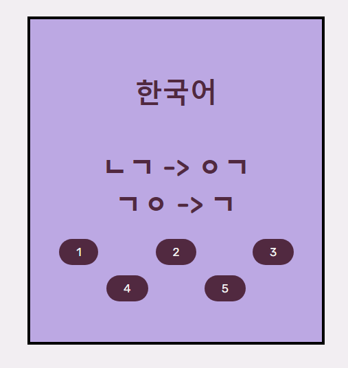

# What is KADecks?

KADecks is a Korean Vocaublary Flashcard Program , employing spaced repetition methodology to optimize your memory
retention while minimizing study time. The program utilizes the SM-2 algorithim outlined in 
https://super-memory.com/english/ol/sm2.htm, ensuring an effective interval system for memory retention.
Distinct from other vocabulary flashcard tools like Anki, KADecks empowers you with the ability to rate each vocabulary 
item on a scale of 1 to 5, allowing for precise user input for how well they remembered the vocabulary. This 
approach allows the program to make superior decisions on when to reintroduce specific vocabulary to be reviewed again.
By doing so, KADecks enhances your learning experience and helps push your journey in gaining Korean linguistic
proficiency.

Additionally, each flashcard has all of the Korean consonant assimilation rules on the back of the card where the Korean
can be found. This application is primarily meant for new learners where learning and remembering consonant assimilation 
rules can be challenging, and there are not many resources out there to practice with.

The program has all the expected functions for an app of its nature. You are given the ability to create new decks,
edit decks you created, and view your statistics on the profile page. On your profile is a stat checker of the
amount of decks you are subscribed to, and the amount of unique vocabulary you have reviewed
(you can also see the amount of unique vocabulary per deck as reviewing). This way, you can view your overall 
achievements and even boast to friends about how far you have come in your Korean learning journey! Additionally, 
you can upload a profile picture to tailor your profile page when showing to friends.

Users are also heavily encouraged to send reviews to me about how I
can improve any part of the application (and yes they are all read).

# About This Project
This project was of passion to mine as I have already spent multiple years learning Japanese, and one year learning 
Chinese, recently finding interest in learning the Korean language. However, one concept I struggle(d) hard with was 
consonant assimilation. Personally, I found this a very difficult part of the Korean language when starting out, as
each time I was reviewing vocabulary, I would have to go into a handbook of rules that I wrote for all of these, as 
there are not many good English resources showcasing them. Especially, there are no English resources that show them as 
you are revieiwing vocabulary. On top of
this, I felt that apps such as Anki that also implements space-based repetition was missing out by only using a range
of 1-3 for showing how well you remembered the vocabulary. I personally at times felt between numbers, and a scale of
1-5 far better fits my desire of assessing myself properly. For all of these reasons, I felt heavily inspired to take
my idea of this application and code it from start to finish.

If you wish to run this program directly from the source code, all that needs to be altered is the MySQL database that
the flask app accesses, and the methods for retrieving the data can be found in data.py.

If you wish to try the program out from the web, the website can be found at: INVALID
(If the application can not be found at it's link, or is said to be INVALID, then the page is down due to funding and
upkeep costs.)

# About Consonant Assimilation
For starters, the Korean language utilizes 한글 (Hangul) as it's writing system. The 한글 alphabet is composed of 14 
consonants and 10 vowels (with additional other complex letters that are made by combining basic letters). Each letter
is written in syllabic blocks, where each letter can have either one consonant and one vowel, or two consants and a 
vowel. For example, the letter 한 is composed of the ㅎ, ㅏ, and ㄴ, meanwhile a letter such as 가 only has two 
components, ㄱ and ㅏ. This last potential character at the bottom of each letter is called a 받침(batchim). 

A unique pattern appears with letter containing a batchim followed by another letter known as "Consonant Assimilation".
This occurs as some sounds for a variety of reasons, the primary being convenience in pronunciation as some consonants
can be difficult to pronounce consecutively. The basic notion behind consonant assimilation is that the end of one 
character can assimilate with the start of the next, creating a different sound than expected.
For example, the word 같이 to a new learner would supposedly be pronounced (가티 - ga ti),
however the sounds assimilate, and it becomes 가치(gachi). This would be considered the ㅌ + ㅇ rule, where depending on
the vowel that proceeds the ㅇ, the rule can either be that ㅌ + ㅇ converts to either ㅌ or ㅊ (ㅊ in this case).

# How does this program help?
Utilizing the hgtk package (https://pypi.org/project/hgtk/), the program deconstructs Korean characters, in order to 
find all characters containing a batchim and the following initial consant of the next character if there is on.
It then shows what the characters assimilate to.

Here is an example of this with the word for Korean in Korean, "한국어": 

# Technical Portion
The entirety of the backend is programmed using Python in conjunction with flask. All data is stored using
a MySQL database, with over 100 SQL Queries to alter and retrieve data. The entirety of the front end is crafted using 
HTML and CSS, using Jinja2 aswell. Additionally, multiple JavaScript scripts are located throughout the pages in order
to decrease conversation from the back end to the front end, and increase refresh times. 
This application was deployed using AWS Beanstalk, linked with an AWS RDS-hosted MySQL database, however 
KADecks utilizes MySQL databases to host all of the user information, including vocab intervals for each user,
vocabulary information, deck information, profile pictures, and more. 

# Special Thanks
I'd like to give a thank you to the creator of hgtk (Toolkit for Hangul composing) and SuperMemo2 on python,
as these libaries were essential to the creation of this app.

